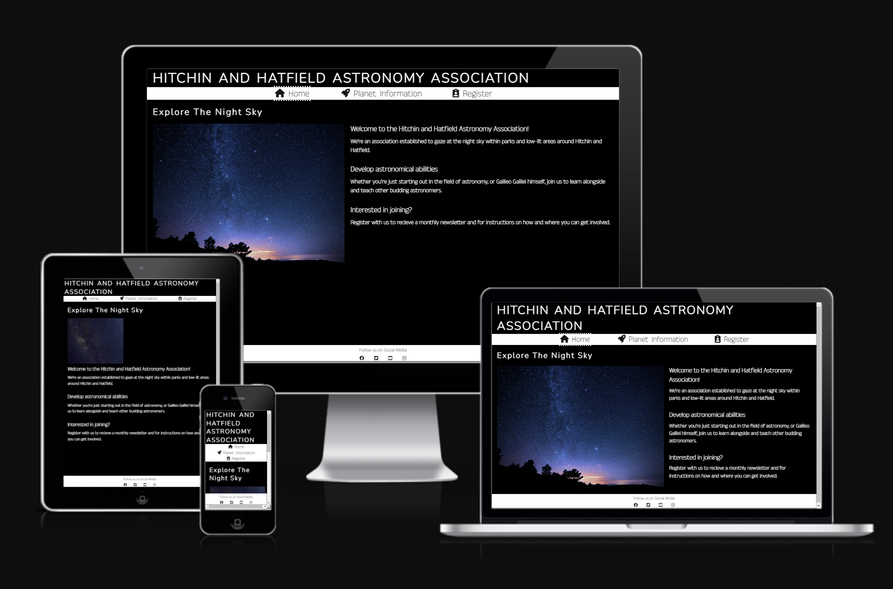
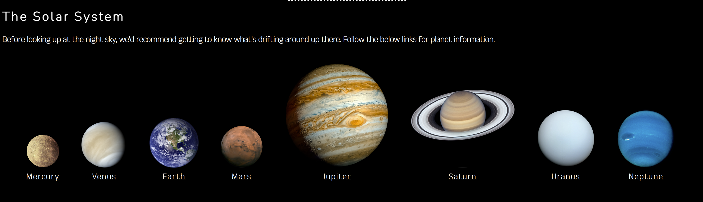
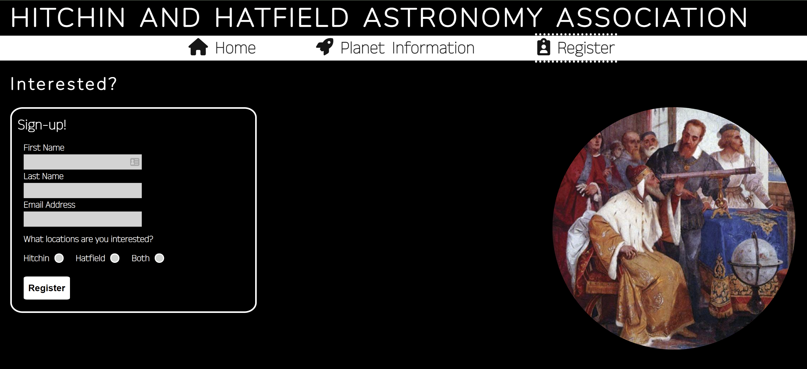
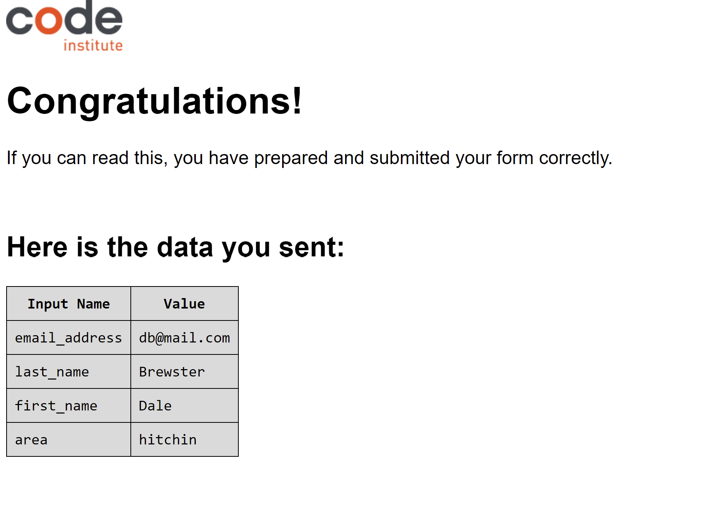
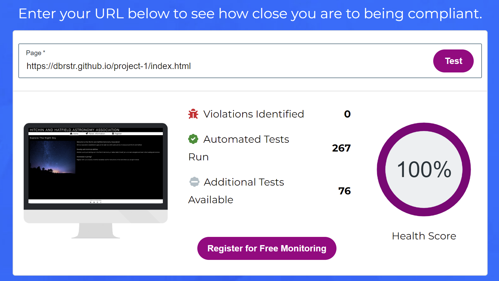
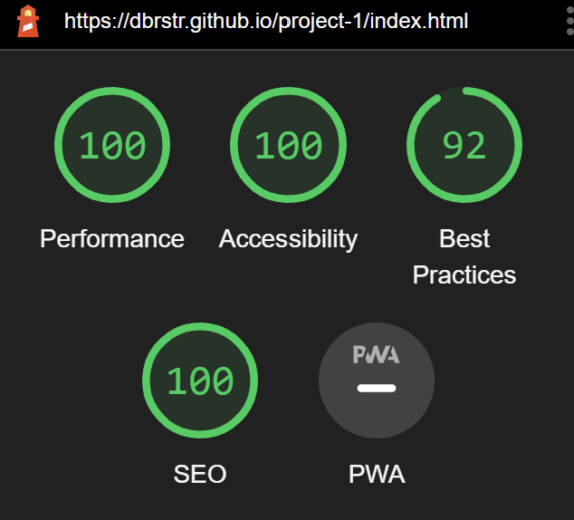

# Hitchin And Hatfield Astronomy Association

The Hitchin And Hatfield Astronomy Association is a page developed to help connect astronomy enthusiasts, from the Hitchin and Hatfield areas, within Hertfordshire.
 
Once signed up, the association will send out weekly news letters, detailing what is running that week, the time and location of those events and a plethora of hints and tips around viewing the night sky.

Visitors of the website will be able to find a breif summary of what the association is about, along with some information around celestial objects within the night sky and a registration form, that once completed, will grant further information on joining in and general astronomer tips.

 

 

 

## Features
 

#### <strong>Heading</strong>
 

The heading is in white text and appears strikingly against the black background, which fits the theme of the rest of the site.

It clearly states the name of the association and has been transformed into uppercase.

The heading links to the home page.

 

#### <strong>Navigation</strong>
 

The navigation bar is at the top of the page, below the main heading and runs horizontally across the screen.

In order from left to right, the links are as follows:
<ul>
<li>'Home'</li>
<li>'Planet Information'</li>
<li>'Register'</li>
</ul>

The links are positioned in the center of the bar, and each link contains both text and an appropriate icon. 

The menu bar contains black text, on white background, which contrasts the sites main theme and draws attention.

The current page is highlighted by white dots above and below the navigation item:

 

#### <strong>Planet Information</strong>
 

The planet Information page consists of 8 colour images of the planets within our solar system, with the planet's name underneath.

The images have been transformed into circles and both the image and the name link to a specific Wikipedia page for each planet. Each external link opens up in a new tab.

The planet information page offers the visitor a convenient way of learning more about each planet, before signing up. 

 

#### <strong>Register</strong>
 

The registration form is used to sign up to the astronomy association, in order to find out more information about how to get involved.

The form is surrounded by a border, as attempting to use a background that was a similar theme to the menu bar, made text input slightly less clear.

The form fields consist of two text fields, one email field and a radio button to select the area most relevant to the visitor.

All fields are required, so you cannot register without filling them in.

<em>NOTE:</em>
The submit button action, links to The Code Institutes form dump URL - when submitting the information via the pages link on github, you will recieve the error:

        405 Not Allowed

 

 

## Testing
 

I've tested and confirmed this website functions on the below browsers:

<ul>
<li>Chrome</li>
<li>Edge</li>
<li>Firefox</li>
<li>Safari</li>
</ul>

The website is responsive and looks good across multiple display sizes - this was tested using the built in devtools in Chrome.

The submit buttons action, links to a form dump URL supplied by the Code Institute - this submit works when the project is launched from GitPod, via the command "python3 -m http.server":

 

<strong>As noted in the Features section, the submit button displays an error when you submit the completed form - I do not have access to a site/database where I can post data to, so have reused a URL that came from a forms lesson from the Code Institute. This errors out when posted from GitHub pages.</strong>

 

 

## Bugs
 

#### <strong>Solved Bugs</strong>
 

On smaller screens, the image of Galileo on the registration page, would align itself behind the form, making the form hard to read. A work-around has been put in place, using an additional media screen styling rule, to hide the image when the display width is below 767 pixels.

 

The picture source displayed on the home screen when below 1150 pixels was not displaying on GitHub pages - this was due to the use of an absolute file path. Changing this to a relative file path resolved the issue.

 

As part of the testing stages, lighthouse was used to check page load speeds. The 'Register' page scored 87 in performacnce (amber), as the image was a large file and the extension was PNG. Converting this to WEBP and then compressing the image, brought the overall performance score up to 99.

 

#### <strong>Unsolved Bugs</strong>
 

As stated above, there is a known bug wth the submit button on the registration form, that causes a 405 error when data is submitted. This is not something I can rectify currently, as it is posting to a server I have no control over. I would like to readdress this in the future, though do not have a time-frame on this currently.

 

 

## Validator Testing
 

<strong>HTML Validator</strong>

    "Document checking completed. No errors or warnings to show."

<strong>CSS Validator</strong>

    "Congratulations! No Error Found."

<strong>Accessibility</strong>

<a href="https://www.webaccessibility.com/" target="_blank" rel="noopener">WebAccessibility</a> was used to test accessibility. No violations were found:

 

<strong>Lighthouse Ratings</strong>

 

 

## Deployment

The site has been deployed to GitHub Pages. The procedure is outlined below:

<ul>
<li>In the GitHub repository, go to 'Settings'</li>
<li>From the source section drop-down menu, select the Master Branch</li>
<li>Once selected, the webpage is generated</li>
</ul>

 

 

## Credits
 

<strong>Code Institute</strong>

Form Dump URL 

https://formdump.codeinstitute.net/

Love running Project

 

<strong>Stack Overflow</strong>

Information on how to change Radio button styles

 

<strong><a href="https://fontawesome.com/v6/icons/" target="_blank" rel="noopener">Font Awesome</a></strong>

Menu Icons

 

<strong><a href="https://www.pexels.com/" target="_blank" rel="noopener">Pexels</a></strong>

Main page images

 

<strong><a href="https://nas.gov" target="_blank" rel="noopener">NASA</a></strong>

Images of planets

